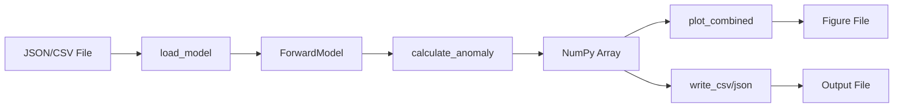

# Architecture

This document describes the architecture and design decisions of Forward Model.

## Project Structure

```
forward-model/
├── forward_model/          # Main package
│   ├── __init__.py        # Public API exports
│   ├── __main__.py        # CLI entry point
│   ├── cli/               # Command-line interface
│   │   ├── __init__.py
│   │   └── commands.py    # Typer commands (run, validate, visualize)
│   ├── compute/           # Calculation algorithms
│   │   ├── __init__.py
│   │   └── talwani.py     # Talwani algorithm implementation
│   ├── io/                # Input/output handlers
│   │   ├── __init__.py
│   │   ├── loaders.py     # Load from JSON/CSV
│   │   └── writers.py     # Write to CSV/JSON/NumPy
│   ├── models/            # Data models
│   │   ├── __init__.py
│   │   └── forward_model.py  # Pydantic models
│   └── viz/               # Visualization
│       ├── __init__.py
│       └── plots.py       # Matplotlib plotting functions
├── tests/                 # Test suite
│   ├── unit/              # Unit tests
│   └── integration/       # Integration tests
├── examples/              # Example model files
├── docs/                  # Documentation
├── Makefile              # Development commands
└── pyproject.toml        # Project configuration
```

## Design Principles

### 1. Separation of Concerns

Each module has a single, well-defined responsibility:

- **`models`**: Data validation and structure
- **`compute`**: Numerical algorithms
- **`io`**: File I/O operations
- **`viz`**: Plotting and visualization
- **`cli`**: User interface

### 2. Type Safety

Use Pydantic for runtime validation and type hints for static checking:

```python
from pydantic import BaseModel, Field
from typing import List, Tuple

class GeologicBody(BaseModel):
    """Validated geological body model."""
    name: str
    susceptibility: float  # Must be finite; negative values allowed
    vertices: List[Tuple[float, float]] = Field(min_length=3)
```

### 3. Simplicity

Prefer simple, readable code over clever optimizations:

```python
# Good: Clear and maintainable
def calculate_anomaly(model: ForwardModel) -> np.ndarray:
    """Calculate total magnetic anomaly."""
    total = np.zeros(len(model.observation_x))
    for body in model.bodies:
        total += _calculate_body_anomaly(body, model)
    return total

# Avoid: Premature optimization
def calculate_anomaly(model: ForwardModel) -> np.ndarray:
    """Calculate with vectorization (harder to maintain)."""
    return np.sum([_calc(b, m) for b, m in zip(model.bodies, [model]*len(model.bodies))], axis=0)
```

### 4. Testability

Design functions to be easily testable:

- Pure functions when possible
- Dependency injection for I/O
- Small, focused units

## Module Details

### models - Data Models

Uses [Pydantic](https://docs.pydantic.dev/) for data validation:

```python
class ForwardModel(BaseModel):
    """Main model class with automatic validation."""
    bodies: List[GeologicBody]
    field: MagneticField
    observation_x: List[float]
    observation_z: float = 0.0

    @field_validator("observation_x")
    def validate_observations(cls, v):
        """Ensure at least one observation point."""
        if len(v) == 0:
            raise ValueError("At least one observation point required")
        return v
```

**Benefits:**

- Runtime validation
- Automatic JSON serialization
- Type hints for IDE support
- Clear error messages

### compute - Talwani Algorithm

Core calculation based on Talwani & Heirtzler (1964):

```python
def calculate_anomaly(model: ForwardModel) -> npt.NDArray[np.float64]:
    """Calculate magnetic anomaly using Talwani algorithm.

    The algorithm computes the magnetic field from 2D polygonal bodies
    using analytical solutions. The total anomaly is the superposition
    of contributions from all bodies.
    """
    x_obs = np.array(model.observation_x)
    z_obs = model.observation_z
    total_anomaly = np.zeros_like(x_obs)

    for body in model.bodies:
        anomaly = _talwani_body(
            vertices=body.vertices,
            susceptibility=body.susceptibility,
            x_obs=x_obs,
            z_obs=z_obs,
            field=model.field
        )
        total_anomaly += anomaly

    return total_anomaly
```

**Key features:**

- Vectorized NumPy operations
- Handles arbitrary polygon shapes
- Superposition principle for multiple bodies

### io - Input/Output

Handles multiple file formats:

**Loaders:**

```python
def load_model(file_path: str) -> ForwardModel:
    """Load model from JSON file."""
    with open(file_path) as f:
        data = json.load(f)
    return ForwardModel(**data)

def load_model_from_csv(file_path: str) -> ForwardModel:
    """Load model from CSV file."""
    # Parse CSV and construct ForwardModel
    ...
```

**Writers:**

```python
def write_csv(file_path: str, x: np.ndarray, anomaly: np.ndarray):
    """Write results to CSV format."""
    with open(file_path, 'w') as f:
        f.write("x,anomaly\n")
        for xi, ai in zip(x, anomaly):
            f.write(f"{xi},{ai}\n")
```

**Design decisions:**

- JSON as primary format (human-readable, standard)
- CSV for legacy/Excel compatibility
- NumPy formats for numerical efficiency

### viz - Visualization

Matplotlib-based plotting with multiple styles:

```python
def plot_combined(
    model: ForwardModel,
    anomaly: np.ndarray,
    save_path: Optional[str] = None,
    style: str = "default",
    dpi: int = 100,
    figsize: Tuple[float, float] = (10, 8)
) -> Figure:
    """Create combined cross-section and anomaly plot."""
    fig, (ax1, ax2) = plt.subplots(2, 1, figsize=figsize, sharex=True)

    # Plot cross-section
    _plot_model_on_axes(ax1, model)

    # Plot anomaly
    _plot_anomaly_on_axes(ax2, model.observation_x, anomaly)

    if save_path:
        fig.savefig(save_path, dpi=dpi, bbox_inches='tight')

    return fig
```

**Features:**

- Three preset styles (default, publication, presentation)
- Multiple output formats (PNG, PDF, SVG, EPS)
- Customizable DPI and figure size
- Returns Matplotlib figure for further customization

### cli - Command-Line Interface

Built with [Typer](https://typer.tiangolo.com/) for modern CLI:

```python
import typer

app = typer.Typer()

@app.command()
def run(
    input_file: str,
    output_csv: Optional[str] = None,
    plot: Optional[str] = None,
    verbose: bool = False
):
    """Run forward model calculation."""
    if verbose:
        typer.echo(f"Loading model from {input_file}...")

    model = load_model(input_file)
    anomaly = calculate_anomaly(model)

    if plot:
        plot_combined(model, anomaly, save_path=plot)

    if verbose:
        typer.echo("✓ Calculation complete")
```

**Benefits of Typer:**

- Automatic help generation
- Type validation
- Rich terminal output
- Easy testing

## Data Flow

### Typical Workflow



### Calculation Pipeline

1. **Load**: Parse input file → Pydantic model
2. **Validate**: Automatic validation via Pydantic
3. **Calculate**: Talwani algorithm → NumPy array
4. **Output**: Write results and/or create plots

## Algorithm: Talwani Method

The Talwani algorithm calculates magnetic anomalies from 2D polygonal bodies using analytical solutions.

### Mathematical Foundation

For a 2D body with vertices (x_i, z_i):

1. **Magnetic potential** from each edge
2. **Derivative** to get field components
3. **Coordinate rotation** to account for field geometry
4. **Superposition** for multiple bodies

### Implementation

```python
def _talwani_body(vertices, susceptibility, x_obs, z_obs, field):
    """Calculate anomaly from single body."""
    # Convert to local coordinates
    dx = x_obs[:, np.newaxis] - vertices[:, 0]
    dz = z_obs - vertices[:, 1]

    # Calculate angles and distances for each edge
    for i in range(len(vertices)):
        j = (i + 1) % len(vertices)  # Next vertex (wrap around)

        # Geometric factors
        theta1, theta2 = _calculate_angles(dx, dz, vertices[i], vertices[j])
        r1, r2 = _calculate_distances(dx, dz, vertices[i], vertices[j])

        # Contribution from this edge
        contribution = _edge_contribution(theta1, theta2, r1, r2)

        # Accumulate
        anomaly += contribution

    # Apply field geometry and susceptibility
    anomaly *= susceptibility * field.intensity
    anomaly = _rotate_to_field(anomaly, field.inclination, field.declination)

    return anomaly
```

### Complexity

- **Time**: O(n × m) where n = observations, m = vertices
- **Space**: O(n) for results array
- **Parallelizable**: Independent observations can be computed in parallel

## Testing Strategy

### Unit Tests

Test individual components in isolation:

```python
def test_talwani_single_vertex():
    """Test Talwani calculation for simple geometry."""
    vertices = [[0, 100], [10, 100], [10, 200], [0, 200]]
    result = _talwani_body(vertices, ...)
    assert result.shape == (n_obs,)
    assert np.all(np.isfinite(result))
```

### Integration Tests

Test complete workflows:

```python
def test_full_workflow(tmp_path):
    """Test complete calculation workflow."""
    # Create test model file
    model_file = tmp_path / "test.json"
    model_file.write_text(json.dumps(test_model_data))

    # Load and calculate
    model = load_model(str(model_file))
    anomaly = calculate_anomaly(model)

    # Verify results
    assert len(anomaly) == len(model.observation_x)
    assert -1000 < anomaly.max() < 1000  # Reasonable range
```

### Test Coverage

Maintain >90% code coverage:

```bash
uv run pytest --cov=forward_model --cov-report=html
open htmlcov/index.html
```

## Performance Considerations

### Optimization Targets

1. **Calculation speed**: Vectorized NumPy operations
2. **Memory usage**: Stream processing for large datasets
3. **I/O efficiency**: Binary formats for large files

### Profiling

Use Python profilers to identify bottlenecks:

```python
import cProfile
import pstats

profiler = cProfile.Profile()
profiler.enable()

# Run calculation
model = load_model("large_model.json")
anomaly = calculate_anomaly(model)

profiler.disable()
stats = pstats.Stats(profiler)
stats.sort_stats('cumtime')
stats.print_stats(10)
```

### Typical Bottlenecks

- Trigonometric functions in edge calculations
- File I/O for large datasets
- Plot rendering for high-DPI figures

## Future Enhancements

Potential areas for expansion:

1. **3D Models**: Extend to 3D prismatic bodies
2. **Remanence**: Add remanent magnetization support
3. **Optimization**: GPU acceleration for large models
4. **Inversion**: Parameter estimation from observed data
5. **Interactive**: Web-based visualization tool

## References

**Algorithm:**

- Talwani, M., & Heirtzler, J. R. (1964). Computation of magnetic anomalies caused by two-dimensional structures of arbitrary shape.

**Implementation:**

- [NumPy Documentation](https://numpy.org/doc/)
- [Pydantic Documentation](https://docs.pydantic.dev/)
- [Matplotlib Documentation](https://matplotlib.org/stable/)

## See Also

- [Contributing Guide](contributing.md) - How to contribute
- [API Reference](../api-reference/index.md) - Detailed API documentation
