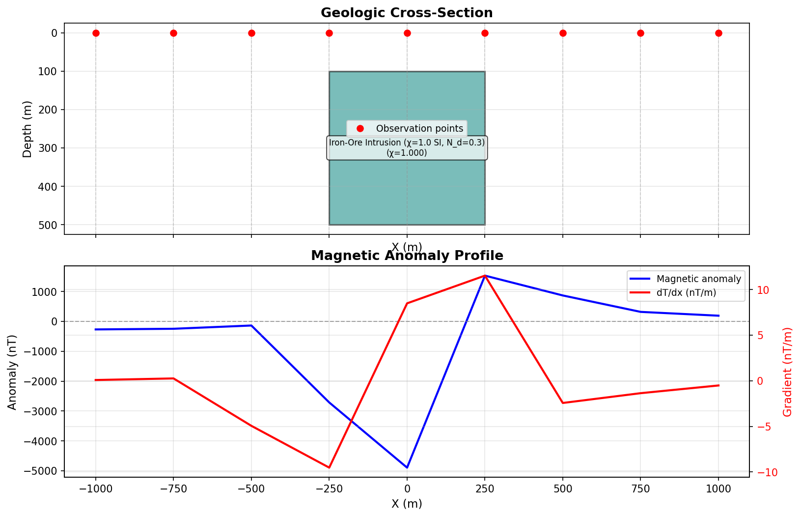

# Theoretical Background

## Introduction

Forward magnetic modeling calculates the magnetic anomaly that would be observed above a geological structure with known geometry and magnetic properties. This is the "forward problem" - predicting observations from a model - as opposed to the "inverse problem" of inferring subsurface structure from observations.

This package implements the **Talwani algorithm** for 2D forward magnetic modeling, originally developed for gravity modeling (Talwani et al., 1959) and adapted for magnetics.

## The Talwani Method

### Historical Context

In 1965, Manik Talwani and colleagues published a seminal paper describing an efficient algorithm for computing the gravity anomaly of a 2D body with arbitrary cross-sectional shape. The method approximates the body as a polygon and uses analytical solutions for the gravitational effect of each edge. This approach was revolutionary because:

1. **Exact solution**: No numerical integration required
2. **Arbitrary geometry**: Any polygon shape can be modeled
3. **Computational efficiency**: Fast enough for interactive modeling

The same mathematical framework applies to magnetic modeling, though with additional complexity due to the vector nature of magnetic fields.

### Key Insight

The Talwani method recognizes that the field from a 2D body (infinite extent perpendicular to the profile) can be computed by summing the contributions from each edge of the polygonal cross-section. Each edge contributes analytically calculable terms involving logarithmic and arctangent functions.

## Physics of Magnetic Anomalies

### Magnetic Susceptibility

Magnetic susceptibility (χ) is a dimensionless quantity that describes how much a material becomes magnetized in an external magnetic field:

```
M = χ * H
```

where:
- **M**: Induced magnetization (A/m)
- **χ**: Magnetic susceptibility (SI units, dimensionless)
- **H**: Magnetic field strength (A/m)

In the SI system, susceptibility values for rocks typically range from:
- Sedimentary rocks: 0.001 - 0.01
- Mafic igneous rocks: 0.05 - 0.15
- Ultramafic rocks: 0.1 - 0.3
- Magnetite-rich rocks: 0.5+

### Induced Magnetization

This implementation models **induced magnetization** - the magnetization acquired by rocks in the present-day Earth magnetic field - as well as **remanent magnetization** (permanent magnetization acquired when rocks formed). See [Remanent Magnetization](#remanent-magnetization) below.

The induced magnetization vector is:

```
M = χ * (B₀ / μ₀)
```

where:
- **B₀**: Earth's magnetic field intensity (nT)
- **μ₀**: Permeability of free space (4π × 10⁻⁷ H/m)

The direction of M is parallel to the inducing field B₀.

### Remanent Magnetization

Remanent magnetization is a permanent magnetization vector fixed at the time of rock formation, independent of the present-day ambient field. Many volcanic and intrusive rocks carry significant remanence that can dominate the total magnetization.

The total magnetization is the vector sum of induced and remanent components:

```
M_total = M_induced + M_remanent
```

The **Königsberger ratio** Q quantifies the relative importance of remanence:

```
Q = |M_remanent| / |M_induced|
```

When Q > 1, remanent magnetization dominates and omitting it leads to significant modeling errors. Volcanic rocks (especially basalts and lava flows) commonly have Q values of 1–10 or higher.

The remanent vector is described by three parameters in the JSON schema:

| Field | Description | Units | Default |
|-------|-------------|-------|---------|
| `remanent_intensity` | Magnitude of remanent magnetization | A/m | 0.0 |
| `remanent_inclination` | Inclination of remanent vector (positive downward) | degrees | 0.0 |
| `remanent_declination` | Declination of remanent vector from north | degrees | 0.0 |

Setting `remanent_intensity=0.0` (the default) recovers the induced-only behaviour.

### Demagnetization Effects

For most exploration targets (χ < 0.1 SI), the standard formula M = χ · H is an excellent approximation. However, for **high-susceptibility bodies** such as magnetite-rich intrusives or iron-ore deposits (χ > 0.3 SI), the body's own magnetization generates an internal field that opposes the external inducing field — the **demagnetizing field**. Ignoring this effect causes the anomaly amplitude to be systematically overestimated.

The corrected **effective susceptibility** is:

```
χ_eff = χ / (1 + N_d · χ)
```

where **N_d** is the **demagnetization factor** (dimensionless). Only the induced component is corrected; the remanent component is unaffected.

#### When does it matter?

| χ (SI) | N_d = 0.3 | χ_eff | Reduction |
|--------|-----------|-------|-----------|
| 0.01   | 0.3       | 0.00997 | < 1% |
| 0.1    | 0.3       | 0.0971  | 3%   |
| 0.5    | 0.3       | 0.400   | 20%  |
| 1.0    | 0.3       | 0.769   | 23%  |
| 2.0    | 0.3       | 1.25    | 38%  |

The correction is negligible for χ < 0.1 and significant for χ > 0.3.

#### Demagnetization factor for 2D bodies

For a 2D infinite-strike body with an elliptical cross-section with horizontal semi-axis *a* and vertical semi-axis *b*, the demagnetization factor (field applied along *b*) is:

```
N_d = b / (a + b)
```

The physical range for 2D infinite-strike bodies is **0 ≤ N_d ≤ 0.5**:

- N_d → 0: wide, flat body (horizontal extent >> vertical extent)
- N_d = 0.5: circular or square cross-section

For arbitrary polygonal cross-sections, `compute_demagnetization_factor(vertices)` estimates N_d using the equivalent ellipse of the bounding box.

Values above 0.5 are only valid for 3D geometries (full 3D spheres have N_d = 1/3 in all directions). Setting `demagnetization_factor` above 0.5 in this 2D tool will trigger a `UserWarning`.

#### Setting the demagnetization factor

The `demagnetization_factor` field on `GeologicBody` defaults to `0.0` (no correction):

```json
{
  "name": "Iron-Ore Intrusion",
  "susceptibility": 1.0,
  "demagnetization_factor": 0.3,
  "vertices": [...]
}
```

To estimate N_d automatically from body geometry:

```python
from forward_model.compute import compute_demagnetization_factor
import numpy as np

vertices = np.array([[-250.0, 100.0], [250.0, 100.0], [250.0, 500.0], [-250.0, 500.0]])
n_d = compute_demagnetization_factor(vertices)  # → 0.444 for this 500×400 m body
```

See `examples/high_susceptibility_intrusion.json` for a worked example.



*Figure: Iron-ore intrusion (χ = 1.0 SI) with demagnetization correction (N_d = 0.3). Effective susceptibility is reduced to χ_eff ≈ 0.769, yielding a ~23% lower anomaly amplitude than an uncorrected model.*

### Earth's Magnetic Field

The Earth's magnetic field is described by three parameters:

1. **Intensity (F)**: Total field strength in nanoTesla (nT)
   - Varies from ~25,000 nT at equator to ~65,000 nT at poles
   - Default value: 50,000 nT (typical mid-latitude)

2. **Inclination (I)**: Angle from horizontal plane
   - Positive downward
   - Varies with latitude: ~0° at equator, ~90° at poles
   - Default value: 60° (Northern mid-latitude)

3. **Declination (D)**: Angle from geographic north
   - Varies globally, typically ±30°
   - For 2D profiles, often set to 0°

### Magnetic Anomaly

The **magnetic anomaly** is the deviation of the observed magnetic field from the expected background (regional) field:

```
ΔB = B_observed - B_regional
```

In forward modeling, we calculate the anomaly caused by subsurface bodies with different susceptibilities than the surrounding rocks. The background field is implicitly assumed to be the Earth's field with no local variations.

This implementation computes five output components from the forward model:

| Component | Symbol | Units | Description |
|-----------|--------|-------|-------------|
| Vertical | Bz | nT | Vertical anomaly field component |
| Horizontal | Bx | nT | Horizontal anomaly field component (along profile) |
| Total field | ΔT | nT | Projection onto inducing field direction |
| Amplitude | \|ΔB\| | nT | Vector magnitude of anomaly field |
| Horizontal gradient | d(ΔT)/dx | nT/m | Spatial derivative of total field along profile |

**Note on By:** In 2D modeling, bodies have infinite extent along the strike direction (y-axis), so the y-component of the anomaly field is identically zero by symmetry. Only Bx and Bz are non-zero.

## Mathematical Formulation

### 2D Approximation

The model assumes bodies have infinite extent perpendicular to the profile (the "strike" direction). This is valid when:
- Body length >> body width
- Profile is perpendicular to strike
- We're interested in the central portion of the body

For 2D bodies, the magnetic potential at point (x, z) due to a polygonal body is:

```
U(x,z) = (χ * F / μ₀) * Σ G_i
```

where G_i represents the contribution from edge i of the polygon.

### Edge Contributions

For each edge defined by vertices (x₁, z₁) and (x₂, z₂), the algorithm accumulates two geometric integrals per observation point (Talwani, 1965):

```
Δθ  = θ₂ − θ₁              (subtended angle)
log = ln(r₂ / r₁)           (log of distance ratio)
```

where θᵢ and rᵢ are the angle and distance from the observation point to vertex i. The edge direction cosines tx and tz define the geometry.

The two field components contributed by each edge are:

**Vertical component (Bz):**
```
Bz_edge = C · [ Mx · (log·tx − Δθ·tz) + Mz · (log·tz + Δθ·tx) ]
```

**Horizontal component (Bx):**
```
Bx_edge = C · [ Mx · (Δθ·tx + log·tz) + Mz · (−Δθ·tz + log·tx) ]
```

where:
- **C**: Scaling constant combining susceptibility, field intensity, and μ₀
- **Mx, Mz**: Horizontal and vertical components of the total magnetization vector
- Both formulas share all intermediate variables, so Bz and Bx are computed simultaneously in one edge loop

After summing over all edges and all bodies, three derived quantities are computed:

**Total field anomaly (ΔT)** — projection of the anomaly vector onto the inducing field direction:
```
ΔT ≈ Bx · cos(I) · cos(D) + Bz · sin(I)
```

**Vector amplitude** — magnitude of the anomaly field:
```
|ΔB| = sqrt(Bx² + Bz²)
```

**Horizontal gradient** — spatial derivative of total field along the profile:
```
d(ΔT)/dx
```

This is the correct forward model of a **total-field gradiometer** system, which measures the difference in ΔT between two spatially separated sensors divided by their baseline.

### Superposition Principle

When multiple bodies are present, the total anomaly is the sum of individual anomalies:

```
ΔB_total = Σ ΔB_i
```

This linearity arises from the linear relationship between magnetization and susceptibility in the induced-only case.

## Coordinate System

### Conventions

- **X-axis**: Horizontal position along profile (meters)
  - Typically increases left-to-right
  - No inherent origin; can be centered on bodies or set arbitrarily

- **Z-axis**: Depth below observation surface (meters)
  - **Positive downward** (following geophysics convention)
  - Origin (z=0) is typically the observation surface
  - Bodies are at positive z values (below surface)

- **Y-axis**: Perpendicular to profile (into the page)
  - Assumed infinite extent
  - Not explicitly modeled

### Observation Points

Observation points are typically along a horizontal line at z = 0 (ground surface) or z = constant (airborne survey). The algorithm computes both the vertical (Bz) and horizontal (Bx) anomaly components at each observation point, from which the total field anomaly (ΔT), vector amplitude, and horizontal gradient are derived.

## Algorithm Implementation

### Input Data

1. **Bodies**: List of polygons, each defined by:
   - Ordered vertices (x, z) defining the cross-section
   - Magnetic susceptibility (SI units)
   - Optional name for identification

2. **Magnetic field**: Earth's field parameters
   - Intensity (nT)
   - Inclination (degrees)
   - Declination (degrees)

3. **Observation points**: X-coordinates where anomaly is calculated
4. **Observation depth**: Z-coordinate of observation points (usually 0)

### Computation Steps

1. **Validate input**: Check geometry, ensure closed polygons, verify parameters

2. **For each body, for each observation point**:
   - Transform coordinates to observation point reference frame
   - For each edge of the body polygon:
     * Calculate geometric terms (Δθ, log, tx, tz)
     * Accumulate Bz and Bx edge contributions simultaneously
   - Store body-level Bz and Bx arrays

3. **Superpose** Bz and Bx across all bodies

4. **Derive model-level components** from superposed Bz and Bx:
   - ΔT: project onto inducing field direction
   - |ΔB|: vector magnitude
   - d(ΔT)/dx: central-difference gradient along observation x-coordinates

5. **Output results**: `AnomalyComponents(bz, bx, total_field, amplitude, gradient)` or a single selected component array

### Numerical Considerations

- **Singularities**: When observation point lies on a body edge, special handling prevents division by zero
- **Precision**: Double-precision (float64) used throughout
- **Stability**: Arctangent functions use atan2 for correct quadrant handling

## Assumptions and Limitations

### Assumptions

1. **2D geometry**: Bodies have infinite extent perpendicular to profile
2. **Total magnetization**: Both induced and remanent magnetization are modeled; remanent defaults to zero
3. **Uniform susceptibility**: Each body has constant susceptibility
4. **Non-interacting bodies**: Bodies don't affect each other's magnetization
5. **Optional demagnetization correction**: Self-demagnetization can be applied per-body via `demagnetization_factor` (default 0.0 = no correction)
6. **Flat observation surface**: All observation points at same elevation

### Limitations

1. **Not suitable for**:
   - 3D bodies (finite strike length)
   - Body-to-body demagnetization interactions
   - Demagnetization factors above 0.5 (3D geometries only)

2. **Accuracy depends on**:
   - Validity of 2D approximation
   - Knowledge of susceptibility values
   - Accuracy of field parameters
   - Appropriateness of polygon approximation

## Validation and Testing

The implementation can be validated by:

1. **Simple geometries**: Comparing to analytical solutions for simple shapes
2. **Known benchmarks**: Reproducing published examples
3. **Physical consistency**: Checking that anomalies behave as expected
4. **Conservation**: Verifying superposition principle

## References

1. **Talwani, M., Worzel, J. L., & Landisman, M. (1959).** Rapid gravity computations for two-dimensional bodies with application to the Mendocino submarine fracture zone. *Journal of Geophysical Research*, 64(1), 49-59.

2. **Talwani, M., & Heirtzler, J. R. (1964).** Computation of magnetic anomalies caused by two-dimensional structures of arbitrary shape. *Computers in the Mineral Industries*, 464-480.

3. **Talwani, M. (1965).** Computation with the help of a digital computer of magnetic anomalies caused by bodies of arbitrary shape. *Geophysics*, 30(5), 797–817. *(Source for the simultaneous Bz and Bx edge formulas)*

4. **Blakely, R. J. (1995).** *Potential Theory in Gravity and Magnetic Applications.* Cambridge University Press. (Comprehensive textbook on potential field methods)

5. **Dobrin, M. B., & Savit, C. H. (1988).** *Introduction to Geophysical Prospecting* (4th ed.). McGraw-Hill. (Classical geophysics textbook)

6. **Sharma, P. V. (1997).** *Environmental and Engineering Geophysics.* Cambridge University Press. (Applied geophysics with magnetic methods)

## Further Reading

For practical usage examples, see `examples.md`.

For API documentation, see the package docstrings or generate documentation with:
```bash
python -m pydoc forward_model
```
