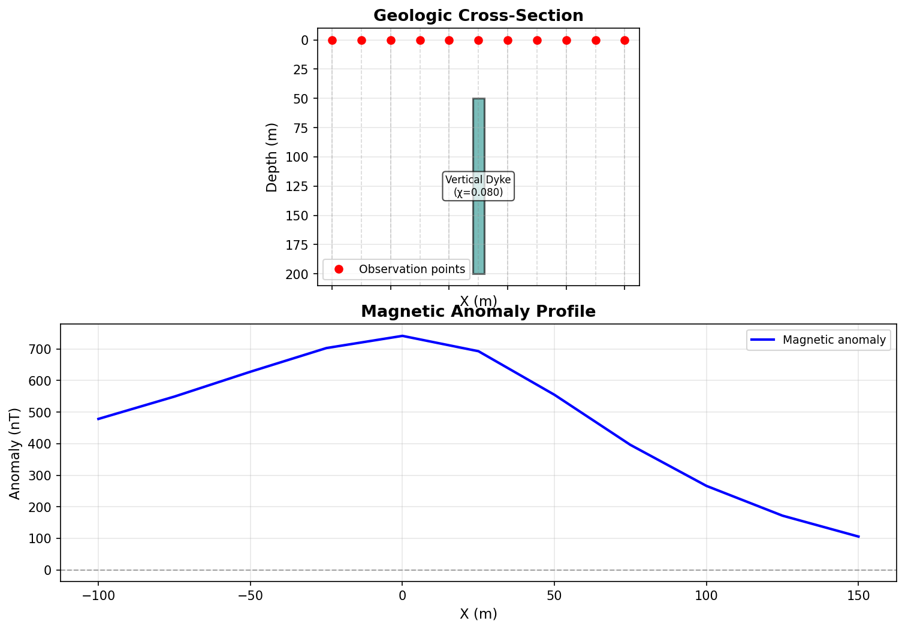
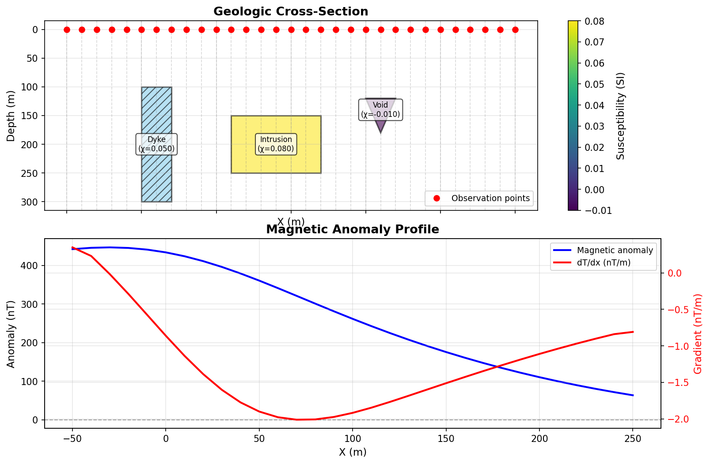

# Examples

This guide provides detailed examples of using Forward Model for various geological scenarios.

## Example 1: Simple Vertical Dyke

Model a vertical mafic dyke cutting through the subsurface.

### Model Definition

```json
{
  "bodies": [
    {
      "name": "Vertical Dyke",
      "susceptibility": 0.08,
      "vertices": [
        [20.0, 50.0],
        [30.0, 50.0],
        [30.0, 200.0],
        [20.0, 200.0]
      ]
    }
  ],
  "field": {
    "intensity": 50000.0,
    "inclination": 60.0,
    "declination": 0.0
  },
  "observation_x": [-100, -75, -50, -25, 0, 25, 50, 75, 100, 125, 150],
  "observation_z": 0.0
}
```

### Parameters

- **Body geometry**: 10m wide dyke from 50-200m depth
- **Susceptibility**: 0.08 SI (mafic rock)
- **Magnetic field**: 50,000 nT at 60° inclination (mid-latitude)
- **Observation**: Surface profile from -100 to 150m

### Running the Model

```bash
# CLI
forward-model run examples/simple_dyke.json --plot dyke.png --verbose

# Python
from forward_model import load_model, calculate_anomaly, plot_combined

model = load_model("examples/simple_dyke.json")
anomaly = calculate_anomaly(model)
plot_combined(model, anomaly, save_path="dyke.png")
```

### Expected Results

- **Anomaly type**: Dipolar (positive over body, negative flanks)
- **Peak amplitude**: ~280 nT
- **Anomaly width**: ~150m (wider than body due to field geometry)



*Figure: Vertical dyke model showing cross-section geometry (top) and magnetic anomaly profile (bottom). The characteristic dipolar signature results from the 60° field inclination.*

---

## Example 2: Multiple Bodies

Model multiple interacting geological bodies.

### Model Definition

```json
{
  "bodies": [
    {
      "name": "Dyke",
      "susceptibility": 0.05,
      "vertices": [[0.0, 100.0], [20.0, 100.0], [20.0, 300.0], [0.0, 300.0]]
    },
    {
      "name": "Intrusion",
      "susceptibility": 0.08,
      "vertices": [[60.0, 150.0], [120.0, 150.0], [120.0, 250.0], [60.0, 250.0]]
    },
    {
      "name": "Void",
      "susceptibility": -0.01,
      "vertices": [[150.0, 120.0], [170.0, 120.0], [160.0, 180.0]]
    }
  ],
  "field": {
    "intensity": 50000.0,
    "inclination": 60.0,
    "declination": 0.0
  },
  "observation_x": [
    -50, -40, -30, -20, -10, 0, 10, 20, 30, 40, 50,
    60, 70, 80, 90, 100, 110, 120, 130, 140, 150,
    160, 170, 180, 190, 200, 210, 220, 230, 240, 250
  ],
  "observation_z": 0.0
}
```

### Key Concepts

- **Superposition**: Total anomaly is sum of individual body contributions
- **Depth effect**: Deeper bodies produce broader, lower-amplitude anomalies
- **Interference**: Nearby bodies can enhance or suppress anomalies

### Python Analysis

```python
from forward_model import load_model, calculate_anomaly, plot_combined
import numpy as np

model = load_model("examples/multi_body.json")

# Calculate total anomaly
total_anomaly = calculate_anomaly(model)

# Calculate individual contributions
individual_anomalies = []
for body in model.bodies:
    single_body_model = model.model_copy(update={"bodies": [body]})
    individual_anomalies.append(calculate_anomaly(single_body_model))

# Verify superposition
calculated_sum = np.sum(individual_anomalies, axis=0)
print(f"Total anomaly matches sum: {np.allclose(total_anomaly, calculated_sum)}")

# Plot
plot_combined(model, total_anomaly, save_path="multi_body.png")
```



*Figure: Multiple interacting bodies including a dyke, intrusion, and void (negative susceptibility). The total anomaly is the superposition of individual contributions from each body.*

---

## Example 3: Dipping Dyke

Model a dyke with arbitrary dip angle.

### Model Definition

```python
from forward_model.models import ForwardModel, GeologicBody, MagneticField
import numpy as np

# Define dipping dyke geometry
dip_angle = 70  # degrees from horizontal
thickness = 10  # meters
top_depth = 50
bottom_depth = 200

# Calculate vertices for dipping geometry
x_top_left = 0
x_top_right = thickness / np.sin(np.radians(dip_angle))
x_bottom_right = x_top_right + (bottom_depth - top_depth) / np.tan(np.radians(dip_angle))
x_bottom_left = x_bottom_right - thickness / np.sin(np.radians(dip_angle))

vertices = [
    [x_top_left, top_depth],
    [x_top_right, top_depth],
    [x_bottom_right, bottom_depth],
    [x_bottom_left, bottom_depth]
]

# Create model
body = GeologicBody(
    name="Dipping Dyke",
    susceptibility=0.08,
    vertices=vertices
)

field = MagneticField(
    intensity=50000.0,
    inclination=60.0,
    declination=0.0
)

model = ForwardModel(
    bodies=[body],
    field=field,
    observation_x=list(range(-100, 151, 5)),
    observation_z=0.0
)

# Calculate and plot
from forward_model import calculate_anomaly, plot_combined

anomaly = calculate_anomaly(model)
plot_combined(model, anomaly, save_path="dipping_dyke.png")
```

### Applications

- Fault zones
- Feeder dykes to volcanic systems
- Tilted layers

---

## Example 4: Sensitivity Analysis

Investigate how anomaly changes with model parameters.

### Varying Susceptibility

```python
from forward_model import load_model, calculate_anomaly
import matplotlib.pyplot as plt
import numpy as np

# Load base model
base_model = load_model("examples/simple_dyke.json")
x = np.array(base_model.observation_x)

# Test different susceptibilities
susceptibilities = [0.02, 0.05, 0.08, 0.10, 0.15]

plt.figure(figsize=(10, 6))
for susc in susceptibilities:
    # Update susceptibility
    model = base_model.model_copy(deep=True)
    model.bodies[0].susceptibility = susc

    # Calculate anomaly
    anomaly = calculate_anomaly(model)

    # Plot
    plt.plot(x, anomaly, label=f"κ = {susc:.2f} SI")

plt.xlabel("Distance (m)")
plt.ylabel("Magnetic Anomaly (nT)")
plt.title("Sensitivity to Susceptibility")
plt.legend()
plt.grid(alpha=0.3)
plt.savefig("sensitivity_susceptibility.png", dpi=150)
```

### Varying Depth

```python
# Test different depths
depths = [30, 50, 75, 100, 150]

plt.figure(figsize=(10, 6))
for depth in depths:
    model = base_model.model_copy(deep=True)

    # Shift all vertices to new depth
    vertices = model.bodies[0].vertices
    depth_offset = depth - vertices[0][1]  # Top of body
    new_vertices = [[x, z + depth_offset] for x, z in vertices]
    model.bodies[0].vertices = new_vertices

    anomaly = calculate_anomaly(model)
    plt.plot(x, anomaly, label=f"Depth = {depth}m")

plt.xlabel("Distance (m)")
plt.ylabel("Magnetic Anomaly (nT)")
plt.title("Sensitivity to Depth")
plt.legend()
plt.grid(alpha=0.3)
plt.savefig("sensitivity_depth.png", dpi=150)
```

### Varying Field Inclination

```python
# Test different inclinations
inclinations = [0, 30, 60, 75, 90]  # degrees

plt.figure(figsize=(10, 6))
for inc in inclinations:
    model = base_model.model_copy(deep=True)
    model.field.inclination = inc

    anomaly = calculate_anomaly(model)
    plt.plot(x, anomaly, label=f"I = {inc}°")

plt.xlabel("Distance (m)")
plt.ylabel("Magnetic Anomaly (nT)")
plt.title("Sensitivity to Field Inclination")
plt.legend()
plt.grid(alpha=0.3)
plt.savefig("sensitivity_inclination.png", dpi=150)
```

---

## Example 5: Exporting Results

Export results in various formats for further analysis.

### Save to Multiple Formats

```python
from forward_model import load_model, calculate_anomaly
from forward_model.io import write_csv, write_json, write_numpy
import numpy as np

model = load_model("model.json")
anomaly = calculate_anomaly(model)
x = np.array(model.observation_x)

# CSV format (for Excel, plotting software)
write_csv("results.csv", x, anomaly)

# JSON format (for reproducibility)
write_json("results.json", model, x, anomaly)

# NumPy format (for numerical analysis)
write_numpy("results.npy", x, anomaly)

print("✓ Results exported to multiple formats")
```

### Load and Replot

```python
import json
from forward_model.models import ForwardModel
from forward_model.viz import plot_combined
import numpy as np

# Load from JSON
with open("results.json") as f:
    data = json.load(f)

model = ForwardModel(**data["model"])
x = np.array(data["results"]["x"])
anomaly = np.array(data["results"]["anomaly"])

# Recreate plot with different style
plot_combined(model, anomaly, save_path="replot.pdf", style="publication", dpi=300)
```

---

## Example 6: Batch Processing

Process multiple models efficiently.

### Batch Script

```python
import glob
from pathlib import Path
from forward_model import load_model, calculate_anomaly
from forward_model.io import write_csv, write_json
from forward_model.viz import plot_combined

# Setup directories
output_dir = Path("batch_results")
output_dir.mkdir(exist_ok=True)

# Process all models
model_files = glob.glob("models/*.json")
print(f"Processing {len(model_files)} models...")

for model_file in model_files:
    name = Path(model_file).stem
    print(f"  Processing {name}...")

    # Load and calculate
    model = load_model(model_file)
    anomaly = calculate_anomaly(model)

    # Export results
    write_csv(output_dir / f"{name}.csv", model.observation_x, anomaly)
    write_json(output_dir / f"{name}.json", model, model.observation_x, anomaly)

    # Generate plot
    plot_combined(
        model, anomaly,
        save_path=output_dir / f"{name}.png",
        style="default",
        dpi=150
    )

print("✓ Batch processing complete")
```

---

## Example 7: Integration with Other Tools

### Export to GMT (Generic Mapping Tools)

```python
from forward_model import load_model, calculate_anomaly
import numpy as np

model = load_model("model.json")
anomaly = calculate_anomaly(model)

# Write GMT-compatible xyz format
x = np.array(model.observation_x)
y = np.zeros_like(x)  # Assuming 2D profile along y=0

with open("anomaly.xyz", "w") as f:
    for xi, yi, ai in zip(x, y, anomaly):
        f.write(f"{xi:.2f} {yi:.2f} {ai:.2f}\n")

print("✓ Data exported for GMT")
```

### Export to Geosoft

```python
# Export in Geosoft XYZ format
with open("anomaly_geosoft.xyz", "w") as f:
    f.write("/ X,Y,Anomaly\n")
    for xi, ai in zip(x, anomaly):
        f.write(f"{xi:.2f},0.00,{ai:.2f}\n")
```

### Load CSV in Python

```python
import pandas as pd
import matplotlib.pyplot as plt

# Load results
df = pd.read_csv("results.csv")

# Plot
plt.figure(figsize=(10, 4))
plt.plot(df["x"], df["anomaly"], 'b-', linewidth=2)
plt.xlabel("Distance (m)")
plt.ylabel("Magnetic Anomaly (nT)")
plt.grid(alpha=0.3)
plt.savefig("pandas_plot.png", dpi=150)
```

---

## Tips for Creating Models

### Coordinate System

- **X-axis**: Horizontal distance (positive right)
- **Z-axis**: Depth below surface (positive down)
- **Origin**: Usually at surface level (z=0)
- **Units**: Meters for both x and z

### Polygon Conventions

- Vertices must form a closed polygon (first ≠ last, closure is automatic)
- At least 3 vertices required
- Order: Typically counterclockwise, but any order works
- No self-intersecting polygons

### Physical Parameters

**Typical Susceptibilities (SI units):**

- Sedimentary rocks: 0.00001 - 0.001
- Felsic igneous: 0.001 - 0.01
- Intermediate igneous: 0.01 - 0.05
- Mafic igneous: 0.05 - 0.15
- Ultramafic rocks: 0.1 - 0.5
- Magnetite-rich rocks: 0.5 - 5.0

**Earth's Field by Latitude:**

- Equator: I ≈ 0°, F ≈ 30,000 nT
- Mid-latitudes: I ≈ 60°, F ≈ 50,000 nT
- Poles: I ≈ 90°, F ≈ 60,000 nT

### Model Design

1. Start simple (single body)
2. Validate against known solutions
3. Add complexity incrementally
4. Use realistic parameter ranges
5. Document assumptions

---

## See Also

- [CLI Usage](cli.md) - Command-line tools for running examples
- [Visualization](visualization.md) - Creating figures from results
- [API Reference](../api-reference/index.md) - Python API documentation
