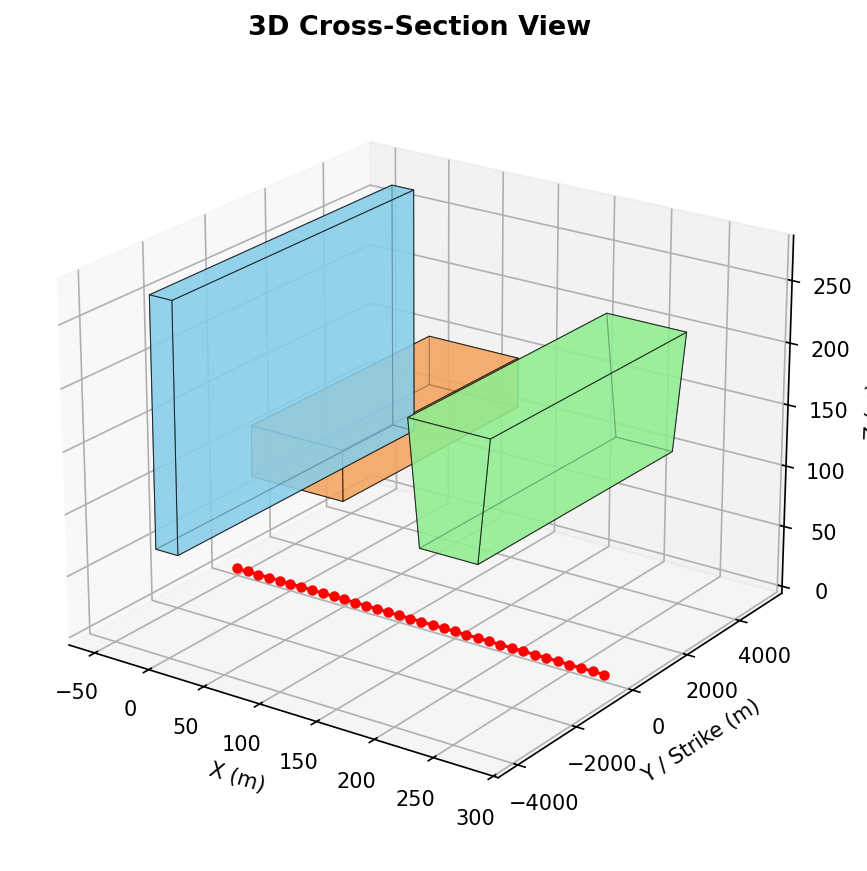

# Visualization

Forward Model provides flexible visualization options for creating publication-quality figures of geological cross-sections and magnetic anomaly profiles.

## Plot Styles

Choose from three built-in styles optimized for different use cases:

### Default Style

General-purpose plots for quick analysis and reports.

```python
from forward_model import load_model, calculate_anomaly, plot_combined

model = load_model("model.json")
anomaly = calculate_anomaly(model)

plot_combined(model, anomaly, save_path="output.png", style="default")
```

**Characteristics:**

- Sans-serif fonts (DejaVu Sans)
- Standard DPI (100)
- Moderate figure size
- Clear and readable

### Publication Style

High-quality figures for journal articles and formal publications.

```python
plot_combined(
    model, anomaly,
    save_path="figure.pdf",
    style="publication",
    dpi=300
)
```

**Characteristics:**

- Serif fonts (DejaVu Serif) for professional appearance
- High DPI (300) for print quality
- Vector-friendly formats (PDF, EPS, SVG)
- Optimized for black & white printing

**Recommended for:**

- Journal submissions
- Technical reports
- Formal presentations

### Presentation Style

Large, bold figures optimized for slideshows and posters.

```python
plot_combined(
    model, anomaly,
    save_path="slide.png",
    style="presentation",
    dpi=150
)
```

**Characteristics:**

- Large fonts for visibility from distance
- Bold lines and markers
- Larger figure size
- High contrast

**Recommended for:**

- Conference presentations
- Posters
- Teaching materials

---

## CLI Usage

Specify style and DPI when visualizing results:

```bash
# Default style
forward-model visualize results.json --output plot.png

# Publication quality
forward-model visualize results.json \
  --output figure.pdf \
  --style publication \
  --dpi 300

# Presentation style
forward-model visualize results.json \
  --output slide.png \
  --style presentation \
  --dpi 150
```

---

## Output Formats

### Raster Formats

**PNG (Portable Network Graphics)**

- Best for: Web, reports, quick sharing
- Lossless compression
- Supports transparency
- File extension: `.png`

```python
plot_combined(model, anomaly, save_path="output.png", dpi=150)
```

### Vector Formats

**PDF (Portable Document Format)**

- Best for: Publications, LaTeX documents
- Scalable without quality loss
- Embeddable in documents
- File extension: `.pdf`

```python
plot_combined(model, anomaly, save_path="output.pdf", dpi=300)
```

**SVG (Scalable Vector Graphics)**

- Best for: Web, editing in Inkscape/Illustrator
- XML-based, editable
- Scalable and lightweight
- File extension: `.svg`

```python
plot_combined(model, anomaly, save_path="output.svg")
```

**EPS (Encapsulated PostScript)**

- Best for: Legacy LaTeX, older journals
- Vector format
- Widely supported
- File extension: `.eps`

```python
plot_combined(model, anomaly, save_path="output.eps", dpi=300)
```

---

## Customization Options

### Figure Size

Control the overall figure dimensions:

```python
import matplotlib.pyplot as plt

fig = plot_combined(model, anomaly, figsize=(10, 8))
```

### DPI (Dots Per Inch)

Control resolution for raster formats:

```python
# Low resolution (screen)
plot_combined(model, anomaly, save_path="low_res.png", dpi=100)

# High resolution (print)
plot_combined(model, anomaly, save_path="high_res.png", dpi=300)

# Very high resolution (posters)
plot_combined(model, anomaly, save_path="poster.png", dpi=600)
```

!!! tip
    DPI only affects raster formats (PNG). Vector formats (PDF, SVG, EPS) scale infinitely.

### Color Schemes

Bodies can be colored by index or susceptibility:

```python
# Color by body index (default)
plot_combined(model, anomaly, color_by="index")

# Color by susceptibility value
plot_combined(model, anomaly, color_by="susceptibility")
```

### Observation Lines

Show or hide vertical lines at observation points:

```python
# Show observation lines (default)
plot_combined(model, anomaly, show_observations=True)

# Hide observation lines
plot_combined(model, anomaly, show_observations=False)
```

---

## Individual Plots

Create separate plots for cross-section and anomaly profile:

### Cross-Section Only

```python
from forward_model.viz import plot_model

fig, ax = plot_model(model)
plt.savefig("cross_section.png", dpi=150, bbox_inches="tight")
```

### Anomaly Profile Only

```python
from forward_model.viz import plot_anomaly
import numpy as np

x = np.array(model.observation_x)
fig, ax = plot_anomaly(x, anomaly)
plt.savefig("anomaly_profile.png", dpi=150, bbox_inches="tight")
```

### Combined Plot (Recommended)

```python
from forward_model.viz import plot_combined

fig = plot_combined(model, anomaly, save_path="combined.png")
```

The combined plot shows:

- **Top panel**: Cross-section with body geometry
- **Bottom panel**: Magnetic anomaly profile
- **Shared x-axis**: Aligned for easy interpretation

---

## 3D Visualization

`plot_model_3d()` extrudes each body's 2D polygon along the y-axis (strike direction)
to give an intuitive 3D view of the cross-section. The y-extent of each body is taken
directly from its strike fields, so 2D, 2.5D, and 2.75D bodies all render correctly
in the same scene.



*Three bodies with different strike configurations — a 2D dyke (blue, full default
extent), a 2.5D sill (orange, symmetric ±3 000 m), and a 2.75D intrusion (green,
5 000 m forward / 2 000 m backward). Red dots mark the observation profile at the
surface.*

### Standalone 3D plot

```python
from forward_model import load_model
from forward_model.viz import plot_model_3d
import matplotlib.pyplot as plt

model = load_model("model.json")

fig = plot_model_3d(model)
fig.savefig("model_3d.png", dpi=150, bbox_inches="tight")
plt.show()
```

### Strike extent rules

| Body type | Fields set | y-extent |
|-----------|-----------|----------|
| 2D (infinite strike) | none | `±default_strike / 2` |
| 2.5D (symmetric) | `strike_half_length` | `±strike_half_length` |
| 2.75D (asymmetric) | `strike_forward` + `strike_backward` | `−strike_backward … +strike_forward` |

The `default_strike` parameter controls how far 2D bodies are extruded when no strike
fields are set. It has no effect on 2.5D or 2.75D bodies.

```python
# 2D bodies extruded ±5 000 m; 2.5D/2.75D bodies use their own fields
fig = plot_model_3d(model, default_strike=10_000.0)
```

### Viewing angle

Adjust the elevation and azimuth to find the best perspective for your geometry:

```python
fig = plot_model_3d(
    model,
    elev=30,    # degrees above horizon
    azim=-45,   # degrees around z-axis
    alpha=0.6,  # face transparency
)
```

### Adding a 3D panel to the combined plot

Pass `show_3d=True` to `plot_combined()` to append a 3D panel below the standard
two-panel figure:

```python
from forward_model import load_model, calculate_anomaly
from forward_model.viz import plot_combined

model = load_model("model.json")
anomaly = calculate_anomaly(model)

fig = plot_combined(
    model,
    anomaly,
    show_3d=True,
    default_strike=10_000.0,   # used only for 2D bodies
    figsize=(12, 12),
    save_path="combined_3d.png",
)
```

!!! note
    `tight_layout()` is skipped when `show_3d=True` because matplotlib's automatic
    layout engine does not support mixed 2D/3D axes. Adjust `figsize` manually if
    panels appear cramped.

---

## Advanced Customization

For maximum control, access the Matplotlib figure and axes:

```python
import matplotlib.pyplot as plt
from forward_model import load_model, calculate_anomaly
from forward_model.viz import plot_combined

model = load_model("model.json")
anomaly = calculate_anomaly(model)

# Create plot
fig = plot_combined(model, anomaly)

# Access axes
axes = fig.get_axes()
cross_section_ax = axes[0]
anomaly_ax = axes[1]

# Customize cross-section
cross_section_ax.set_title("Custom Title", fontsize=16, fontweight="bold")
cross_section_ax.grid(True, alpha=0.3)

# Customize anomaly profile
anomaly_ax.axhline(y=0, color='k', linestyle='--', alpha=0.5)
anomaly_ax.set_ylabel("Magnetic Anomaly (nT)", fontsize=12)

# Save with custom settings
plt.tight_layout()
plt.savefig("custom_plot.pdf", dpi=300, bbox_inches="tight")
plt.close()
```

---

## Examples

### Journal Publication Figure

```python
from forward_model import load_model, calculate_anomaly, plot_combined

model = load_model("model.json")
anomaly = calculate_anomaly(model)

# Create publication-quality figure
fig = plot_combined(
    model, anomaly,
    save_path="manuscript_figure.pdf",
    style="publication",
    dpi=300,
    figsize=(7, 6)  # Typical journal column width
)

print("✓ Figure saved for publication")
```

**Recommended settings for journals:**

- Format: PDF or EPS
- DPI: 300-600
- Style: publication
- Figure width: 3.5" (single column) or 7" (double column)

### Conference Presentation

```python
# Create large, visible figure for slides
fig = plot_combined(
    model, anomaly,
    save_path="conference_slide.png",
    style="presentation",
    dpi=150,
    figsize=(12, 9)
)
```

### Batch Visualization

```python
import glob
from forward_model import load_model, calculate_anomaly, plot_combined

# Process all models
for model_file in glob.glob("models/*.json"):
    print(f"Processing {model_file}...")

    model = load_model(model_file)
    anomaly = calculate_anomaly(model)

    # Generate filename from model file
    output = model_file.replace("models/", "plots/").replace(".json", ".png")

    plot_combined(
        model, anomaly,
        save_path=output,
        style="default",
        dpi=150
    )

print("✓ All plots generated")
```

---

## Tips and Best Practices

### For Publications

- Use PDF or EPS format for scalability
- Set DPI to 300 or higher
- Use publication style with serif fonts
- Check journal figure size requirements
- Include scale bars and units
- Use colorblind-friendly palettes

### For Presentations

- Use PNG format for slides
- Set DPI to 150 for good quality and reasonable file size
- Use presentation style with large fonts
- Test visibility from back of room
- Use high contrast colors
- Avoid small text or fine details

### For Reports

- PNG format is fine for digital reports
- DPI 150 balances quality and file size
- Use default style for consistency
- Include descriptive captions
- Save source data alongside figures

### File Management

```
project/
├── figures/
│   ├── png/         # Raster versions
│   ├── pdf/         # Vector versions for publication
│   └── src/         # Source data (JSON results)
```

### Performance

- Vector formats (PDF, SVG) are slower but scale perfectly
- PNG is fastest for batch processing
- Higher DPI increases file size and processing time
- Use appropriate DPI for your use case

---

## Matplotlib Integration

Forward Model plots are standard Matplotlib figures. You can use any Matplotlib features:

```python
import matplotlib.pyplot as plt
from forward_model import load_model, calculate_anomaly, plot_combined

model = load_model("model.json")
anomaly = calculate_anomaly(model)

# Create plot
fig = plot_combined(model, anomaly)

# Add text annotation
plt.figtext(0.99, 0.01, "Draft - Do Not Distribute",
           ha="right", va="bottom", fontsize=10, color="red", alpha=0.5)

# Adjust layout
plt.tight_layout()
plt.subplots_adjust(hspace=0.3)

# Save and display
plt.savefig("annotated_plot.png", dpi=150, bbox_inches="tight")
plt.show()
```

---

## See Also

- [CLI Usage](cli.md) - Command-line visualization options
- [Examples](examples.md) - See visualization in action
- [API Reference](../api-reference/index.md) - Complete visualization API
